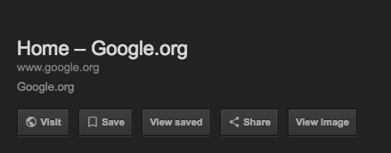

# Bitbucket Diff Tree

Chrome Extension to add back View Image button on Google Images result page.

## Version History
### v1.0.0:
* Initial release

## How to install

## How to set up on local for development

- Open Chrome browser and access chrome extensions by chrome://extensions/
- Make sure the __Developer mode__ checkbox is checked
- Click on __Load unpacked extension...__ and point to the __src__ folder of this repo
- Finish! Now you will see View Image button on Google Images results
